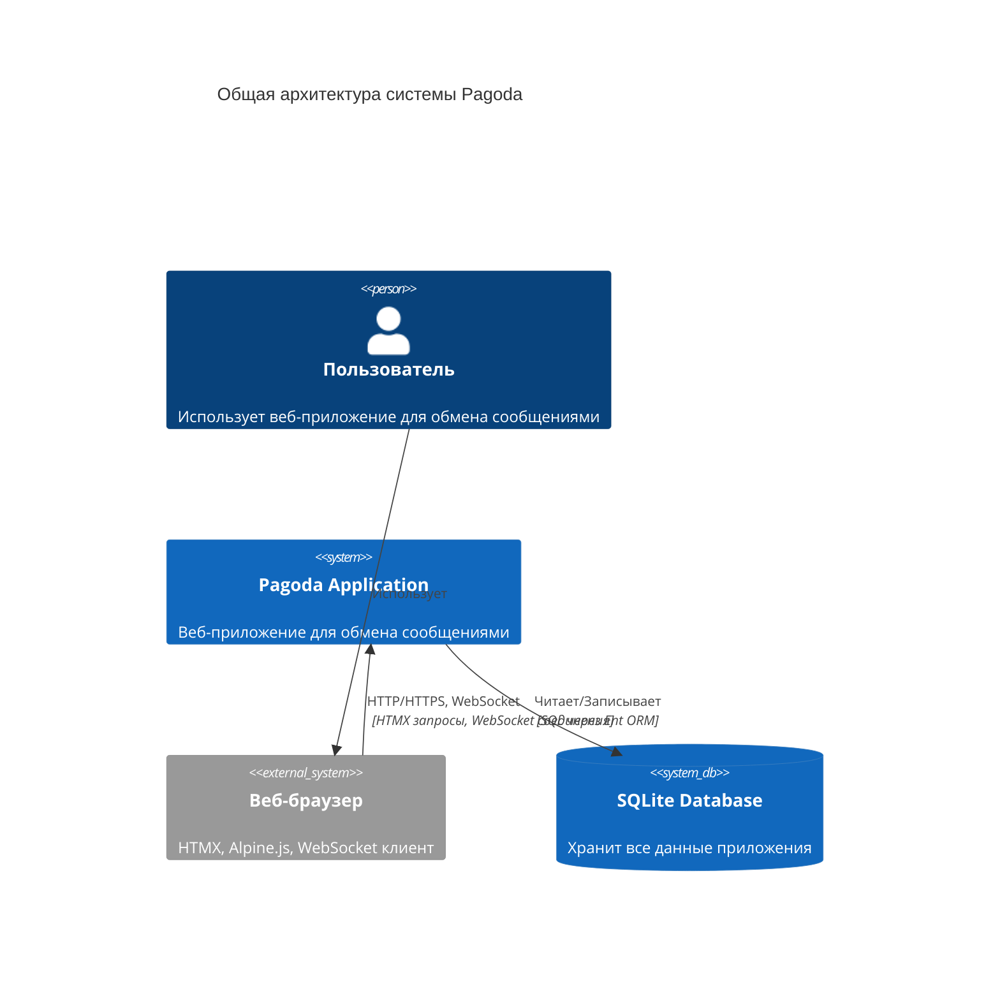
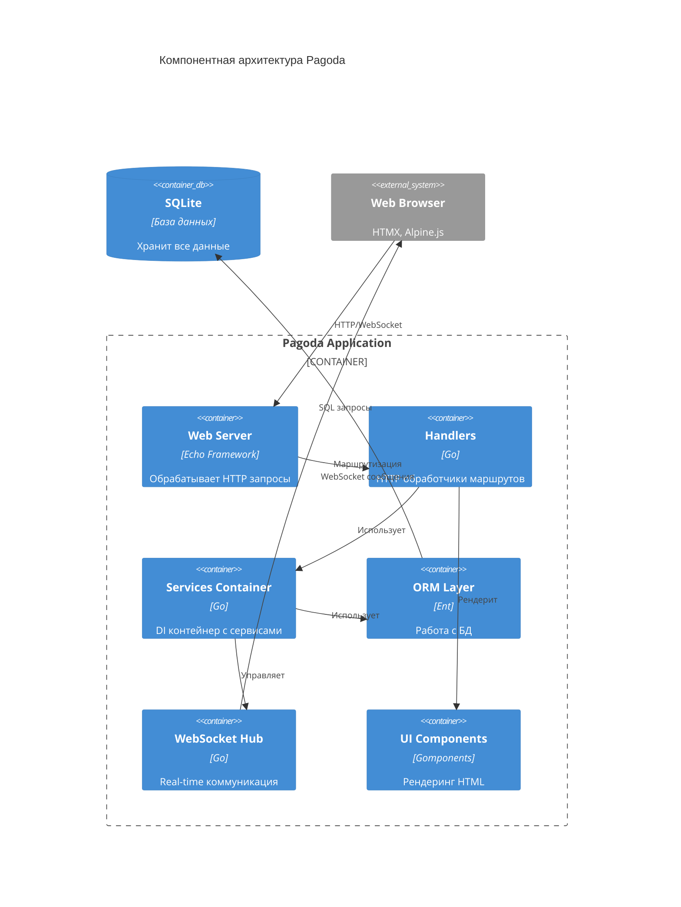
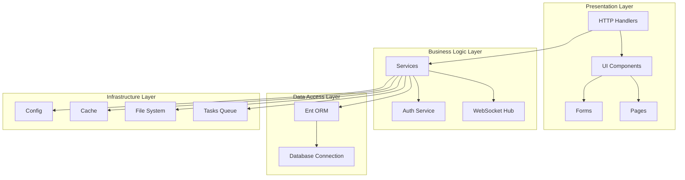
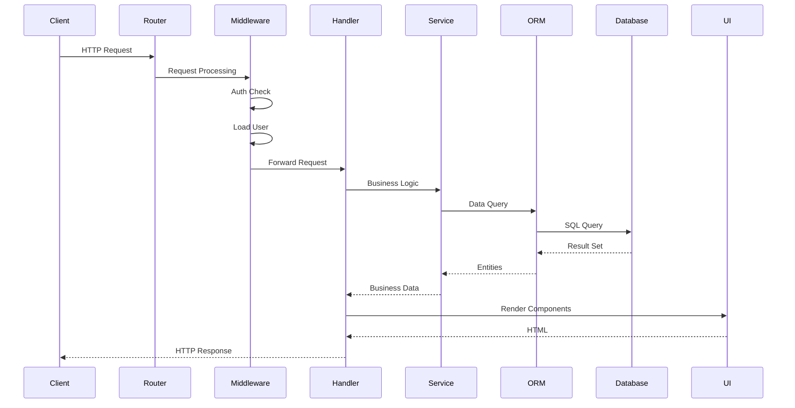
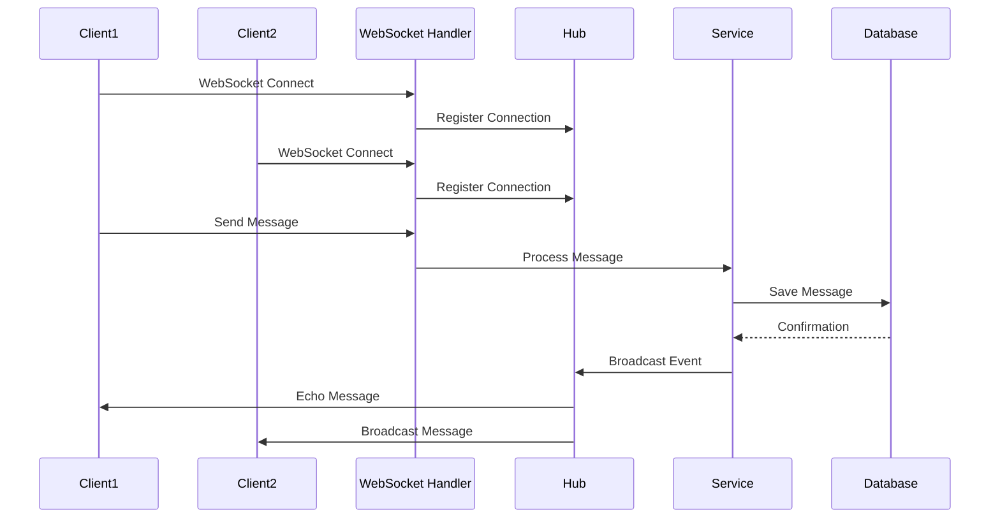
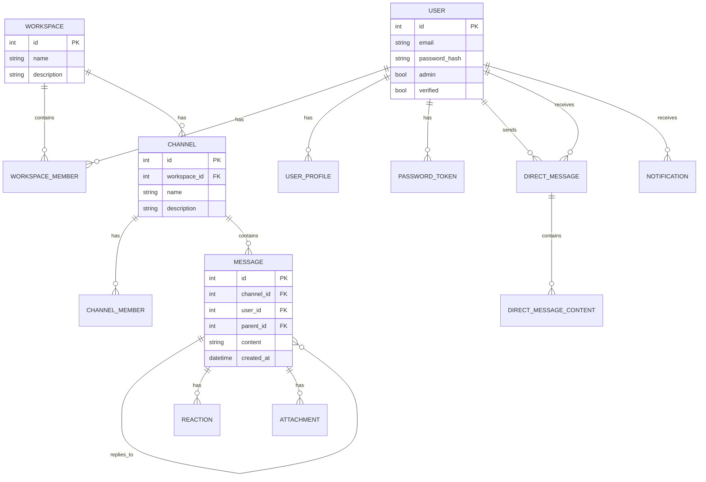
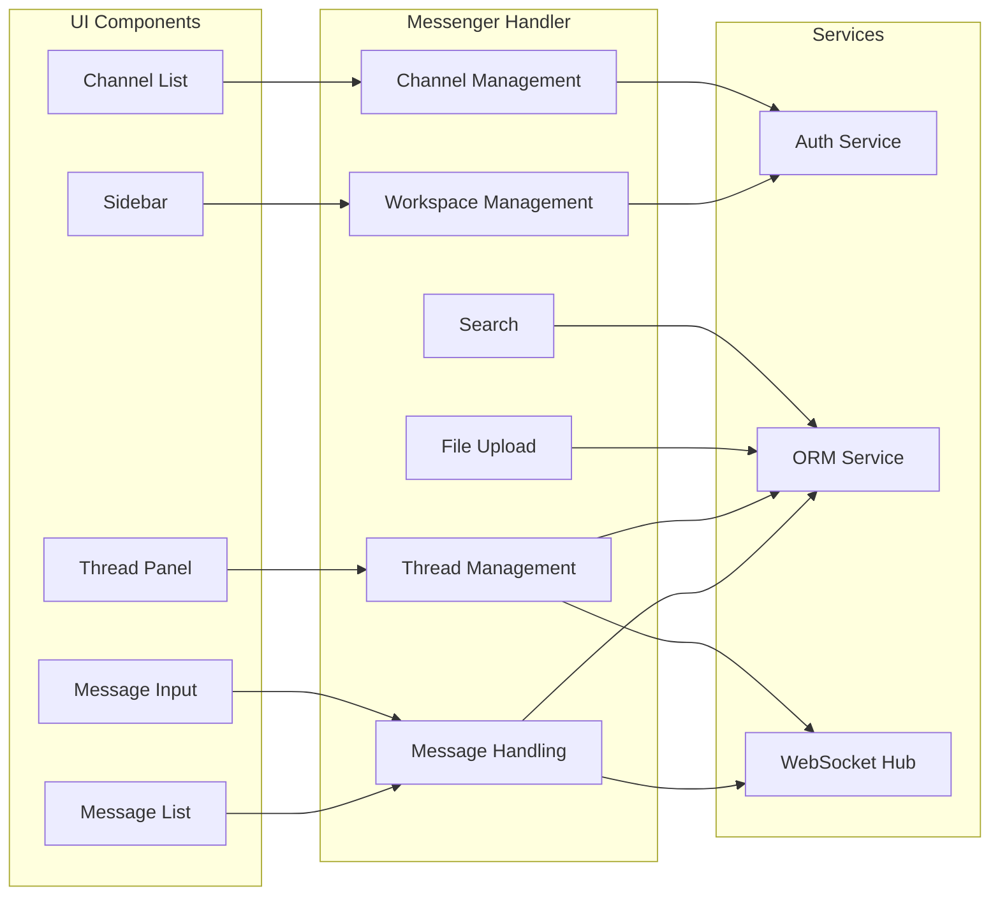
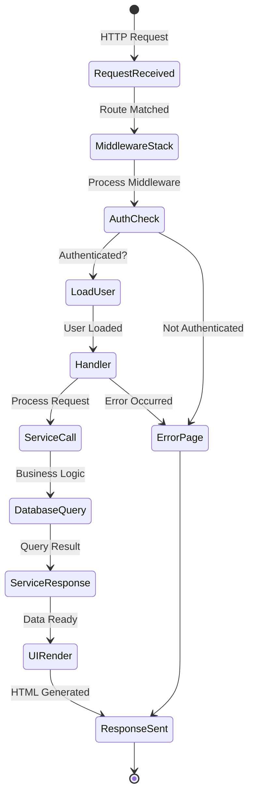

# Архитектура проекта Pagoda (Slack-подобное приложение)

## Оглавление

1. [Обзор проекта](#обзор-проекта)
2. [Структура директорий](#структура-директорий)
3. [Ключевые компоненты](#ключевые-компоненты)
4. [Архитектурные диаграммы](#архитектурные-диаграммы)
5. [Потоки данных](#потоки-данных)

---

## Обзор проекта

**Pagoda** — это веб-приложение для обмена сообщениями (Slack-подобное), построенное на базе Go-фреймворка Pagoda. Проект использует серверный рендеринг HTML с помощью Gomponents, HTMX для интерактивности и WebSocket для real-time коммуникации.

### Основные технологии

- **Backend**: Go 1.24, Echo (веб-фреймворк), Ent (ORM)
- **Frontend**: HTMX, Alpine.js, Tailwind CSS, DaisyUI
- **База данных**: SQLite
- **Real-time**: WebSocket (Gorilla WebSocket)
- **Рендеринг**: Gomponents (HTML компоненты на Go)

---

## Структура директорий

### Корневая структура

```
pagoda/
├── cmd/                    # Точки входа приложения
│   └── web/               # Основной веб-сервер
├── config/                # Конфигурация приложения
├── ent/                   # ORM Ent (сгенерированный код)
│   ├── schema/            # Схемы сущностей базы данных
│   └── admin/             # Расширение для админ-панели
├── pkg/                   # Основная бизнес-логика
│   ├── context/           # Утилиты для работы с контекстом
│   ├── form/              # Обработка форм
│   ├── handlers/          # HTTP обработчики (контроллеры)
│   ├── htmx/              # Утилиты для HTMX
│   ├── log/               # Логирование
│   ├── middleware/        # HTTP middleware
│   ├── redirect/          # Редиректы
│   ├── routenames/        # Имена маршрутов
│   ├── services/          # Сервисы (DI контейнер)
│   ├── session/           # Управление сессиями
│   ├── tasks/             # Фоновые задачи
│   ├── ui/                # UI компоненты
│   │   ├── components/    # Переиспользуемые компоненты
│   │   ├── forms/         # Формы
│   │   ├── layouts/       # Макеты страниц
│   │   ├── pages/         # Страницы
│   │   └── models/         # Модели данных для UI
│   ├── websocket/         # WebSocket сервер
│   └── pager/             # Пагинация
├── public/                # Статические файлы
└── dbs/                   # База данных SQLite (создается автоматически)
```

---

## Ключевые компоненты

### 1. `cmd/web/main.go` — Точка входа

**Назначение**: Инициализация и запуск веб-сервера

**Функциональность**:
- Создание контейнера сервисов (`services.NewContainer()`)
- Построение роутера (`handlers.BuildRouter()`)
- Регистрация очередей задач (`tasks.Register()`)
- Запуск фонового обработчика задач
- Запуск HTTP/WebSocket сервера
- Graceful shutdown

### 2. `pkg/services/container.go` — Контейнер зависимостей

**Назначение**: Централизованное управление всеми сервисами приложения

**Сервисы в контейнере**:
- `Validator` — валидация данных
- `Web` — экземпляр Echo (веб-фреймворк)
- `Config` — конфигурация приложения
- `Cache` — кэш (in-memory на базе Otter)
- `Database` — подключение к БД
- `Files` — файловая система (Afero)
- `ORM` — клиент Ent ORM
- `Mail` — клиент для отправки email
- `Auth` — сервис аутентификации
- `Tasks` — клиент для фоновых задач (Backlite)

**Методы**:
- `NewContainer()` — создание и инициализация контейнера
- `Shutdown()` — корректное завершение работы всех сервисов

### 3. `pkg/handlers/` — HTTP обработчики

#### `router.go`
**Назначение**: Построение HTTP роутера и настройка middleware

**Middleware stack**:
1. HTTPS redirect (если включен)
2. Remove trailing slash
3. Recover (обработка паник)
4. Secure headers
5. Request ID
6. Logger
7. Gzip compression
8. Timeout
9. Config injection
10. Session management
11. Load authenticated user
12. CSRF protection

**Статические файлы**:
- `/static` — CSS, JS, изображения
- `/files` — публичные файлы

#### `messenger_handler.go` (3713 строк)
**Назначение**: Основной обработчик мессенджера

**Функциональность**:
- Управление workspace (рабочими пространствами)
- Управление каналами (channels)
- Отправка и получение сообщений
- Прямые сообщения (direct messages)
- Треды сообщений
- Загрузка файлов
- Поиск по сообщениям
- Управление реакциями
- Управление участниками workspace/channel

**Ключевые методы**:
- `getWorkspaceMemberRole()` — получение роли пользователя
- `requireWorkspaceOwnerOrAdmin()` — проверка прав доступа
- Обработчики для всех CRUD операций

#### `auth_handler.go`
**Назначение**: Аутентификация и авторизация

**Функциональность**:
- Регистрация пользователей
- Вход/выход
- Восстановление пароля
- Верификация email

#### `websocket_handler.go`
**Назначение**: WebSocket соединения для real-time коммуникации

**Функциональность**:
- Установка WebSocket соединений
- Маршрутизация сообщений через WebSocket Hub
- Обработка событий в реальном времени

#### `search_handler.go`
**Назначение**: Поиск по сообщениям и каналам

#### Другие handlers:
- `admin.go` — админ-панель
- `files.go` — загрузка файлов
- `task.go` — управление задачами
- `cache.go` — демо работы с кэшем
- `contact.go` — контактная форма
- `error.go` — обработка ошибок

### 4. `pkg/services/auth.go` — Сервис аутентификации

**Назначение**: Вся логика аутентификации

**Методы**:
- `Login()` — вход пользователя
- `Logout()` — выход
- `GetAuthenticatedUser()` — получение текущего пользователя
- `HashPassword()` — хеширование пароля (bcrypt)
- `CheckPassword()` — проверка пароля
- `GeneratePasswordResetToken()` — генерация токена сброса пароля
- `GetValidPasswordToken()` — валидация токена
- `GenerateEmailVerificationToken()` — JWT токен для верификации email

### 5. `pkg/middleware/` — Middleware

**Файлы**:
- `auth.go` — проверка аутентификации, загрузка пользователя
- `workspace.go` — проверка доступа к workspace
- `channel.go` — проверка доступа к channel

**Middleware функции**:
- `LoadAuthenticatedUser()` — загрузка пользователя из сессии
- `RequireAuthentication()` — требование аутентификации
- `RequireNoAuthentication()` — требование отсутствия аутентификации
- `RequireAdmin()` — требование прав администратора

### 6. `pkg/websocket/` — WebSocket сервер

**Файлы**:
- `hub.go` — центральный хаб для управления соединениями
- `connection.go` — обработка отдельного соединения
- `messages.go` — типы сообщений
- `events.go` — типы событий

**Функциональность**:
- Управление множественными WebSocket соединениями
- Broadcast сообщений всем подключенным клиентам
- Маршрутизация сообщений по каналам/workspace

### 7. `pkg/ui/` — Пользовательский интерфейс

#### `components/` — Переиспользуемые компоненты
- `messenger/` — компоненты мессенджера:
  - `channel_list.go` — список каналов
  - `message_list.go` — список сообщений
  - `message_input.go` — поле ввода сообщения
  - `sidebar.go` — боковая панель
  - `thread_panel.go` — панель тредов
  - `typing_indicator.go` — индикатор печати
  - `user_avatar.go` — аватар пользователя
  - `file_attachment.go` — вложения файлов
  - `modals.go` — модальные окна
  - `search.go` — поиск

#### `pages/` — Страницы приложения
- `messenger/` — страницы мессенджера:
  - `workspace.go` — главная страница workspace
  - `channel.go` — страница канала
  - `direct_message.go` — страница прямых сообщений
  - `workspace_create.go` — создание workspace
  - `workspace_select.go` — выбор workspace
  - `search.go` — страница поиска
- `error.go` — страница ошибок

#### `layouts/` — Макеты страниц
- `messenger.go` — основной макет мессенджера (3-колоночный: sidebar, контент, правая панель)

#### `forms/` — Формы
- `messenger/` — формы мессенджера:
  - `workspace.go` — форма создания workspace
  - `channel.go` — форма создания канала
  - `message.go` — форма отправки сообщения
  - `invite.go` — форма приглашения пользователей

### 8. `ent/schema/` — Схемы базы данных

**Сущности**:

1. **User** — пользователи системы
2. **UserProfile** — профили пользователей
3. **Workspace** — рабочие пространства
4. **WorkspaceMember** — участники workspace (с ролями: owner, admin, member)
5. **Channel** — каналы внутри workspace
6. **ChannelMember** — участники каналов
7. **Message** — сообщения в каналах
8. **DirectMessage** — прямые сообщения между пользователями
9. **DirectMessageContent** — содержимое прямых сообщений
10. **Reaction** — реакции на сообщения
11. **Attachment** — вложения файлов
12. **Notification** — уведомления
13. **PasswordToken** — токены сброса пароля

**Связи**:
- User ↔ WorkspaceMember (многие-ко-многим)
- Workspace ↔ Channel (один-ко-многим)
- Channel ↔ Message (один-ко-многим)
- Message ↔ Message (parent-child для тредов)
- Message ↔ Reaction (один-ко-многим)
- Message ↔ Attachment (один-ко-многим)

### 9. `config/` — Конфигурация

**Файлы**:
- `config.go` — загрузка и структура конфигурации
- `config.yaml` — файл конфигурации

**Основные секции конфигурации**:
- `http` — настройки HTTP сервера (порт, таймауты, TLS)
- `app` — настройки приложения (имя, окружение, ключи шифрования)
- `database` — настройки БД
- `cache` — настройки кэша
- `files` — настройки файловой системы
- `tasks` — настройки фоновых задач
- `mail` — настройки email
- `messenger` — настройки мессенджера (размер файлов, типы)

### 10. `pkg/context/context.go` — Контекст

**Назначение**: Константы ключей для хранения данных в контексте Echo

**Ключи**:
- `AuthenticatedUserKey` — аутентифицированный пользователь
- `UserKey` — пользователь
- `FormKey` — форма
- `PasswordTokenKey` — токен пароля
- `LoggerKey` — логгер
- `SessionKey` — сессия
- `HTMXRequestKey` — данные HTMX запроса
- `CSRFKey` — CSRF токен
- `ConfigKey` — конфигурация
- `MessengerSidebarKey` — данные sidebar мессенджера

**Утилиты**:
- `Cache()` — кэширование значений в контексте запроса

---

## Архитектурные диаграммы

### 1. Общая архитектура системы (C4 Context)



### 2. Компонентная диаграмма (C4 Container)



### 3. Диаграмма слоев приложения



### 4. Диаграмма потока запроса



### 5. Диаграмма WebSocket коммуникации



### 6. Диаграмма структуры данных (ER диаграмма)



### 7. Диаграмма компонентов мессенджера



### 8. Диаграмма жизненного цикла запроса



---

## Потоки данных

### 1. Поток отправки сообщения

1. **Клиент**: Пользователь вводит сообщение в форму
2. **HTMX**: Отправляет POST запрос на `/channel/:id/message`
3. **Router**: Маршрутизирует в `Messenger.MessageSubmit()`
4. **Middleware**: Проверяет аутентификацию и загружает пользователя
5. **Handler**: Валидирует форму, проверяет доступ к каналу
6. **Service (ORM)**: Сохраняет сообщение в БД
7. **WebSocket Hub**: Отправляет событие всем подключенным клиентам канала
8. **UI**: Рендерит новое сообщение через HTMX swap
9. **Клиент**: Получает обновление через WebSocket и HTMX

### 2. Поток создания workspace

1. **Клиент**: Заполняет форму создания workspace
2. **HTMX**: POST запрос на `/workspace/create`
3. **Handler**: `Messenger.WorkspaceCreate()`
4. **Validation**: Проверка данных формы
5. **ORM**: Создание записи Workspace
6. **ORM**: Создание записи WorkspaceMember (owner)
7. **Redirect**: Перенаправление на новый workspace
8. **UI**: Рендеринг страницы workspace

### 3. Поток WebSocket соединения

1. **Клиент**: Устанавливает WebSocket соединение `/ws`
2. **Handler**: `WebSocketHandler.HandleConnection()`
3. **Hub**: Регистрирует соединение в Hub
4. **Client**: Подписывается на события канала/workspace
5. **Event Loop**: Ожидает сообщения от клиента и от сервера
6. **Broadcast**: При новом сообщении Hub отправляет всем подписчикам
7. **Client**: Получает и отображает сообщение в реальном времени

---

## Ключевые файлы и их функциональность

### Обработчики (Handlers)

| Файл | Строк | Функциональность |
|------|-------|------------------|
| `messenger_handler.go` | 3713 | Основная логика мессенджера: workspace, channels, messages, threads, files |
| `auth_handler.go` | ~500 | Аутентификация: регистрация, вход, восстановление пароля |
| `websocket_handler.go` | ~300 | WebSocket соединения и real-time коммуникация |
| `search_handler.go` | ~200 | Поиск по сообщениям и каналам |
| `router.go` | 116 | Построение роутера и настройка middleware |
| `admin.go` | ~300 | Админ-панель для управления сущностями |
| `files.go` | ~200 | Загрузка и управление файлами |
| `error.go` | ~100 | Обработка ошибок и отображение страниц ошибок |

### Сервисы (Services)

| Файл | Функциональность |
|------|------------------|
| `container.go` | DI контейнер, инициализация всех сервисов |
| `auth.go` | Логика аутентификации и авторизации |
| `cache.go` | In-memory кэш на базе Otter |
| `mail.go` | Отправка email (скелет, требует реализации) |
| `validator.go` | Валидация данных форм |

### UI Компоненты

| Директория/Файл | Функциональность |
|----------------|------------------|
| `ui/components/messenger/` | Все компоненты мессенджера |
| `ui/pages/messenger/` | Страницы мессенджера |
| `ui/layouts/messenger.go` | Основной макет (3-колоночный) |
| `ui/forms/messenger/` | Формы для создания workspace, channel, сообщений |

### Схемы базы данных

| Файл | Сущность | Описание |
|------|----------|----------|
| `user.go` | User | Пользователи системы |
| `workspace.go` | Workspace | Рабочие пространства |
| `channel.go` | Channel | Каналы в workspace |
| `message.go` | Message | Сообщения в каналах (с поддержкой тредов) |
| `directmessage.go` | DirectMessage | Прямые сообщения |
| `reaction.go` | Reaction | Реакции на сообщения |
| `attachment.go` | Attachment | Вложения файлов |

---

## Особенности архитектуры

### 1. Dependency Injection через Container

Все сервисы централизованы в `services.Container`, что упрощает:
- Тестирование (легко подменить зависимости)
- Управление жизненным циклом сервисов
- Graceful shutdown

### 2. Server-Side Rendering с Gomponents

- Типобезопасная генерация HTML
- Переиспользуемые компоненты
- Нет необходимости в отдельном фронтенде

### 3. HTMX для интерактивности

- AJAX запросы без JavaScript
- Частичное обновление страниц
- SPA-like опыт без SPA сложности

### 4. WebSocket для real-time

- Мгновенная доставка сообщений
- Индикаторы печати
- Обновления в реальном времени

### 5. Ent ORM

- Типобезопасные запросы
- Автоматические миграции
- Генерация кода из схем

---

## Заключение

Проект Pagoda представляет собой полнофункциональное приложение для обмена сообщениями с современной архитектурой, использующей лучшие практики Go разработки. Архитектура обеспечивает:

- **Масштабируемость**: Четкое разделение слоев
- **Поддерживаемость**: Понятная структура и документация
- **Тестируемость**: DI контейнер упрощает тестирование
- **Производительность**: Эффективные технологии (Echo, SQLite, in-memory cache)
- **UX**: Современный интерфейс без сложного JavaScript

---

*Документ создан: 2025*
*Версия проекта: текущая (sluck branch)*
